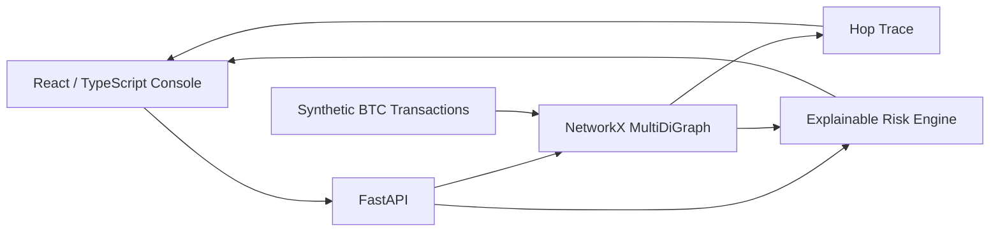

# Crypto Transaction Tracer

[](https://github.com/seoyeonglee/crypto-transaction-tracer/actions/workflows/tests.yml)

**Interactive blockchain-investigation lab with graph tracing, explainable risk signals, and an analyst-style web console.**

> All addresses, transactions, labels, and scenarios in this repository are fictional. The project does not contain real wallet data, sanctioned-address lists, customer information, or employer investigation logic.

## What this project demonstrates

- React + TypeScript investigation console
- interactive transaction-graph visualization with Cytoscape.js
- FastAPI backend built on the existing Python/NetworkX tracing engine
- outbound, inbound, and bidirectional hop tracing
- explainable fan-in, fan-out, peel-chain, and risk-proximity signals
- analyst-facing evidence panels rather than opaque scoring
- synthetic case presets for exposure chains, peel chains, and collectors
- Docker Compose local full-stack execution
- backend tests + frontend production build in GitHub Actions

## Architecture



## Live-demo interaction model

The UI is deliberately styled like an investigation product rather than a generic dashboard:

1. pick an investigation case or seed address;
2. choose hop depth and trace direction;
3. reconstruct the transaction graph;
4. select an address to inspect its score, signals, and connected transactions;
5. review the shortest visible exposure path to a synthetic labelled service;
6. inspect the evidence table supporting the graph.

## Existing tracing engine

The original CLI and reproducible outputs remain intact:

```bash
python src/generate_data.py
python src/run_trace.py --seed-address SEED_WALLET --max-hops 3
pytest -q
```

## Run the live app locally

```bash
docker compose up --build
```

Then open:

- Frontend: `http://localhost:5173`
- API docs: `http://localhost:8000/docs`

## Design principles

- **Synthetic by design** — no real operational targets
- **Explainable** — every score is tied to visible graph signals
- **Investigation-oriented** — patterns are leads, not attribution
- **Reproducible** — deterministic sample generation and automated tests
- **Product-shaped** — browser UI, API boundary, interaction states, and analyst evidence flow

## Tech

React · TypeScript · Cytoscape.js · FastAPI · Python · Pandas · NetworkX · Docker · GitHub Actions
