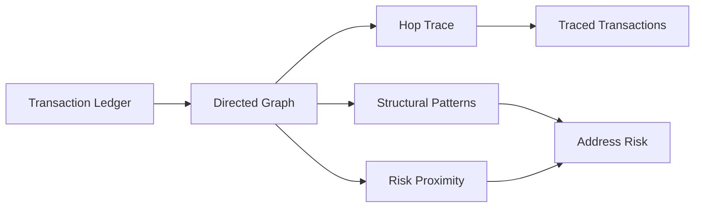

# Crypto Transaction Tracer

[](https://github.com/seoyeonglee/crypto-transaction-tracer/actions/workflows/tests.yml)

A synthetic blockchain-investigation project that models transactions as a directed graph, traces flows from a seed address, and adds explainable structural and proximity-based risk signals.

> All addresses, transactions, labels, and scenarios in this repository are fictional. The project does not contain real wallet data, sanctioned-address lists, customer information, or employer investigation logic.

## What it does

- builds a directed multi-graph from transaction records
- traces outgoing transactions from a seed address by hop distance
- detects fan-out and fan-in patterns
- identifies a simplified peel-chain structure
- measures graph proximity to synthetic high-risk service labels
- produces address-level risk scores and traceable transaction outputs

## Architecture



## Example investigation

The checked-in sample contains a fictional flow:

```text
SEED_WALLET
   |
   v
BRIDGE_A
   |----> FANOUT_1 ----> SYNTH_MIXER
   |----> FANOUT_2 ----> SYNTH_HIGH_RISK_SERVICE
   |----> FANOUT_3
   |----> FANOUT_4
   |----> FANOUT_5
   '----> FANOUT_6
```

The system flags `BRIDGE_A` for fan-out plus two-hop proximity, while the two intermediate addresses receive one-hop exposure signals.

## Project structure

```text
crypto-transaction-tracer/
├── data/
│   ├── README.md
│   └── sample_transactions.csv
├── docs/
│   ├── architecture.md
│   └── methodology.md
├── output/
│   ├── address_risk.csv
│   ├── traced_transactions.csv
│   └── summary.json
├── src/
│   ├── generate_data.py
│   ├── graph.py
│   ├── patterns.py
│   └── run_trace.py
├── tests/
├── requirements.txt
└── README.md
```

## Run it

Windows:

```powershell
py -m venv .venv
.\.venv\Scripts\python.exe -m pip install -r requirements.txt
.\.venv\Scripts\python.exe src\generate_data.py
.\.venv\Scripts\python.exe src\run_trace.py --seed-address SEED_WALLET --max-hops 3
.\.venv\Scripts\python.exe -m pytest -q
```

macOS/Linux:

```bash
python -m venv .venv
source .venv/bin/activate
pip install -r requirements.txt
python src/generate_data.py
python src/run_trace.py --seed-address SEED_WALLET --max-hops 3
python -m pytest -q
```

## Outputs

- `output/traced_transactions.csv` — transactions reachable from the selected seed
- `output/address_risk.csv` — graph structure, synthetic labels, triggered signals, risk score, and severity
- `output/summary.json` — run-level investigation summary

## Design principles

- **Synthetic by design:** no real operational targets
- **Explainable:** every score is tied to visible graph signals
- **Investigation-oriented:** hop tracing and structure are kept separate from attribution
- **Reproducible:** deterministic sample generation and automated tests

See [`docs/methodology.md`](docs/methodology.md) for caveats and production considerations.

## Tech

Python · Pandas · NetworkX · Blockchain Analytics · Graph Analysis · Risk Investigation
