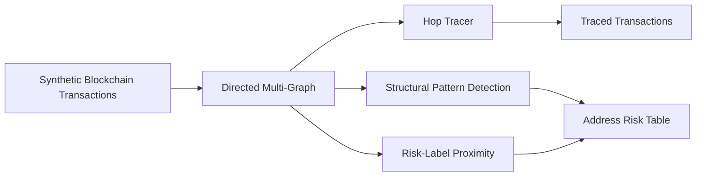

# Architecture

## Components

- **Graph builder** converts transaction rows into a directed multi-graph.
- **Hop tracer** follows outgoing flows from an investigation seed address.
- **Structural detector** identifies fan-in, fan-out, and simplified peel-chain patterns.
- **Risk proximity engine** measures graph distance to synthetic high-risk service labels.
- **Reporting layer** exports traceable transaction and address-level results.
